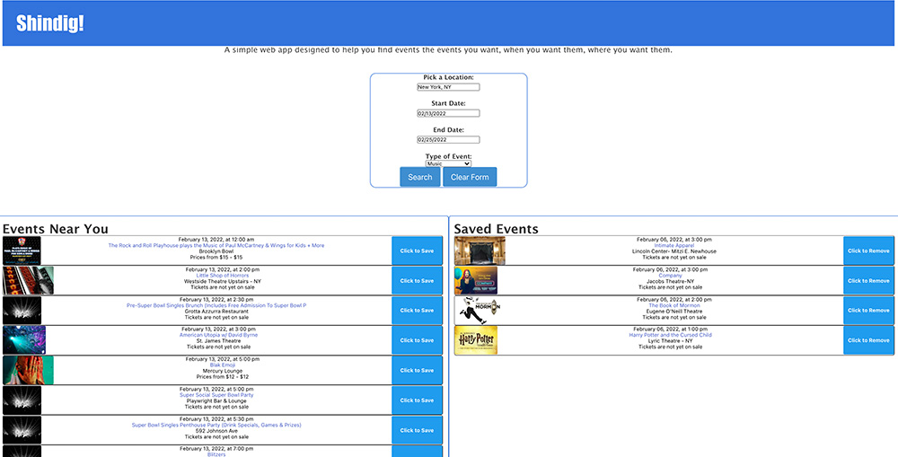

# shindig

*Coding bootcamp assignment*

Shindig is an interactive webpage that that uses Google and Ticketmaster APIs to return event search results to a user using the following langauges and libraries:

HTML
CSS
Bulma
JS
jQuery
Moment

[Link to Live Site](https://cathmcneel.github.io/shindig/)

Made by: Catherine Mcneel, Becket Chanbliss, Steven Calebrese
